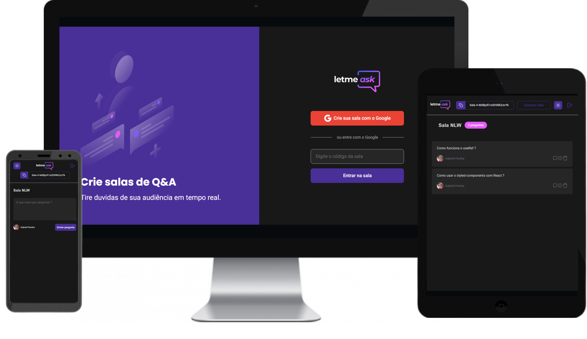

<h2 align="center">
  
</h2>
  
<p align="center">
  

  
  	
  <a href="https://www.linkedin.com/in/gabriel-pereira-oliveira-78b1801ab/">
    
  </a>
	  
  <a href="https://github.com/Gabrielpdev/letmeask/commits/master">
    
  </a>

  
  
  <a href="https://github.com/Gabrielpdev/letmeask/stargazers">
    
  </a>

</p>

<h2 align="center">
  
</h2>


## 📝 Conteúdo
<p align="center">
<a href="#about">Sobre</a>&nbsp;&nbsp;&nbsp;|&nbsp;&nbsp;&nbsp;
<a href="#getting_started">Iniciando</a>&nbsp;&nbsp;&nbsp;|&nbsp;&nbsp;&nbsp;
<a href="#built_using">Tecnologias Utilizadas</a>&nbsp;&nbsp;&nbsp;|&nbsp;&nbsp;&nbsp;
<a href="#contribute">Como contribuir</a>&nbsp;&nbsp;&nbsp;|&nbsp;&nbsp;&nbsp;
</p>


## 🧐 Sobre <a name = "about"></a>

LetMeAsk é uma Aplicação feita durante a **NWL together** oferecido pela [Rocketseat] :rocket:.<br/> 
o objetivo do LetMeAsk é ajudar algum palestrante ou alguém que deseja responder perguntas, nessa aplicação
os usuario fazer o login usando sua conta google e após podem realizar as perguntas entrando nas salas, já o
 dono da sala, pode excluir perguntas, destacar e marcar como pergunta respondida. você pode acessar ela 
 <a href="https://letmeask-gabrielpdev.vercel.app/">clicando aqui</a><br/> 
## 🏁 Iniciando <a name = "getting_started"></a>

Instruções de como instalar a aplicação na sua máquina.

### ⚒ Instalando <a name = "installing"></a>

```
# 💻 Iniciando

$ cd letmeask
$ yarn install
$ yarn start

```
## ⛏️ Tecnologias Utilizadas <a name = "built_using"></a>

As seguintes ferramentas foram usadas na construção do projeto:
- 🔥 [Firebase][firebase]
- 🔵 [TypeScript][typescript]
- ⚛️ [React][reactjs]
- 💅 [Styled-components][styled-components]

## 🤔 Como contribuir <a name = "contribute"></a>

- Faça um fork desse repositório;
- Cria uma branch com a sua feature: `git checkout -b minha-feature`;
- Faça commit das suas alterações: `git commit -m 'feat: Minha nova feature'`;
- Faça push para a sua branch: `git push origin minha-feature`.

Feito com ❤️ por Gabriel Pereira 👋🏽 [Entre em contato!](https://www.linkedin.com/in/gabriel-pereira-oliveira-78b1801ab/)

[firebase]: https://firebase.google.com/
[typescript]: https://www.typescriptlang.org/
[reactjs]: https://reactjs.org
[Rocketseat]:https://github.com/Rocketseat
[styled-components]:https://styled-components.com/

